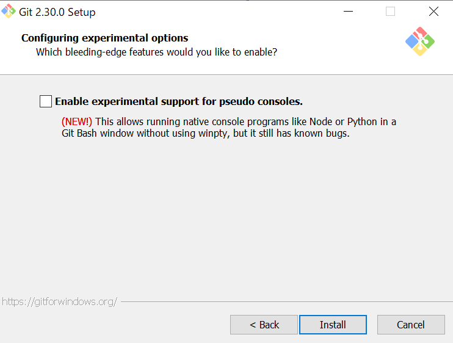

# Git

## Gitのインストール

1. こちらの[リンク](https://git-scm.com/download/win)からインストーラをダウンロード．
1. インストーラを実行し，ライセンスを確認後，Nextをクリック．

1. インストール場所を確認し，Nextをクリック．

1. 項目を確認し，Nextをクリック．

    - Windows Exploror Integration
    - Git Bash Here
    - Git GUI Here
    - Git LFS
    - Associate .git* configuration files with the default text editor
    - Associate .sh files to be run with Bash
1. `Git`のままNextをクリック．

1. デフォルトエディタをVisual Studio Codeに変更．
(必須ではないが推奨)
変更しない場合はそのままNextをクリック．

1. `Let Git decide`を選択し，Nextをクリック．

1. `Git from the command line and also from 3rd-party software`を選択し，Nextをクリック．

1. `Use the OpenSSL library`を選択し，Nextをクリック．

1. `Checkout as-is, commit as-is`を選択し，Nextをクリック．
OSによって異なる改行コードを自動で変換してくれるが，トラブルの元になる可能性があるため，無効化しておく方が良いらしい．

1. `Use MinTTY`を選択し，Nextをクリック．
(コマンドプロンプトに思い入れがあるなら`Use Windows' default console window`を選択しても良い．)

1. `Default`を選択し，Nextをクリック．

1. `Git Credential Manager Core`を選択し，Nextをクリック．

1. `Enable file system caching`，`Enable symbolic links`にチェックを入れ，Nextをクリック．

1. `Enable experimental support for pseudo consoles`にはチェックを入れずに，Installをクリック．


---

## Gitの使い方

### Gitの初期化

ターミナルで次のコマンドを実行する．
これは1度だけで良い．

```:
> git config --global user.name [Name]
> git config --global user.email [MailAddress]
```

Visual Studio Codeをデフォルトエディタとして使用する場合はこちらも実行する．

```:
> git config --global core.editor "code --wait"
```

### Gitを利用する

ターミナルで，バージョン管理したいプロジェクトのルートディレクトリまで移動し，バージョン管理の準備をする．
これはプロジェクト毎に1度で良い．

```:
> cd ./sampleproject
> git init
```

インデックスに追加する．
追加されていないファイル，ディレクトリの変更は反映されない．

```:
> git add samplefile.py
```

全てのファイル，ディレクトリをインデックスに追加する場合は，次のコマンドを実行しても良い．

```:
> git add --all
または
> git all -A
```

インデックスに追加された変更内容をリポジトリに記録する．
`"first commit"`はコミットメッセージと言い，変更内容を記述するが，今回は初めてのコミットなのでfirst commitとした．

```:
> git commmit -m "first commit"
```

ではここでsamplefile.pyを変更してみる．
今のブランチを確認すると`master`(今後`main`になる可能性あり)になっている．

```:
> git branch
* master
```

ここでブランチを切って，`master`から新しく作ったブランチ(ここでは`update-message`)に切り替える．

```:
> git checkout -b update-message
Switched to a new branch 'update-message'
```

ここでブランチを確認すると，`update-message`になっている．

```:
> git branch
  master
* update-message
```

これで変更は`update-message`ブランチ内のみに反映されるようになったため，samplefile.pyを変更してみる．

```python:samplefile.py
print("Bye.")
```

既にGitでバージョン管理されているファイル，ディレクトリのみをインデックスに追加するには，次のコマンドを実行する．

```:
> git add --update
または
> git all -u
```

リポジトリにコミットする．

```:
> git commit -m "update message"
```

この変更を`master`ブランチにも反映させるにはブランチのマージを行う．

```:
> git checkout master
Switched to branch 'master'
> git merge update-message
Updating [コミットID]..[コミットID]
Fast-forward
 samplefile.py | 2 +-
 1 file changed, 1 insertion(+), 1 deletion(-)
```

これで変更が完了した．

もし誤ってファイルを消してしまったり，取り消したい操作を行ってしまった場合，次のコマンドで前のコミット状態のブランチに戻すことができる．

```:
> git checkout -f
```
