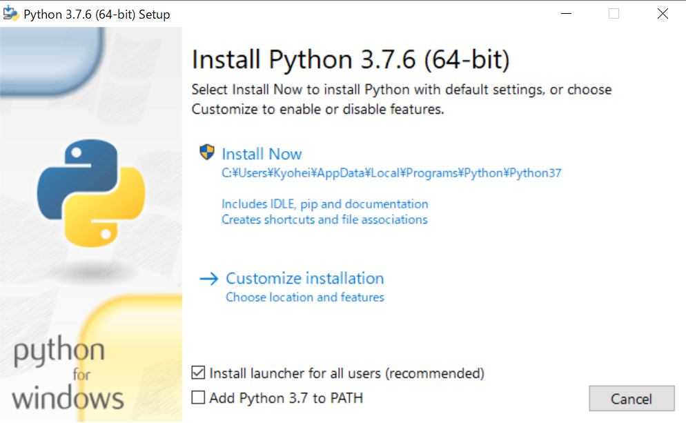
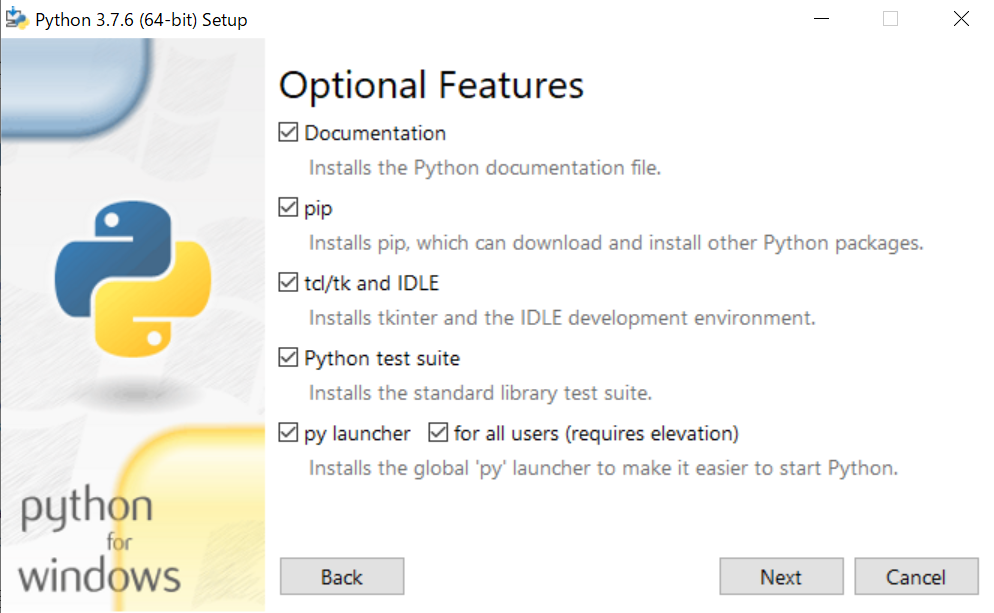
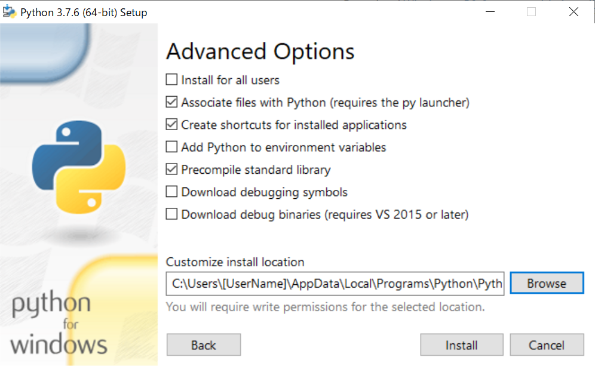

# Python

## Python3.7.6のインストール

1. こちらの[リンク](https://www.python.org/ftp/python/3.7.6/python-3.7.6-amd64.exe)からインストーラをダウンロード．

1. インストーラを実行し，そのままInstall Nowをクリック．
`Add Python3.7 to PATH`はチェックしなくても良い．
デフォルトのインストール先は`C:/Users/[UserName]/AppData/Local/Programs/Python/Python37`になる．
**変更したい場合はCustomize Installationをクリック．**

`Customize Installation`を選択した場合は，全てチェックを付けてNextをクリック．
`Documentation`は任意．


これでPythonのインストールは完了．

---

## パッケージのインストール

ターミナルを開き，pipのアップグレードを行う．
pipはPython標準のパッケージインストーラで，pipを介して様々なパッケージをインストールできる．

```:
> py -m pip install --upgrade pip
```

次に，必要なパッケージのインストールを行う．
今回は必要なパッケージをrequirements.txtにまとめてあるので，まとめてインストールする．

```:
> py -m pip install -r ./requirements.txt
```

今後パッケージを追加したくなったら，次のコマンドを実行すると良い．

```:
> py -m pip install [PackageName]
```

---

## Pythonの実行

Pythonのプログラムファイルを実行するには，ターミナルで`py`コマンドに続けて実行したいpyファイルへのパスを入力する．

```:
> py ./hello.py
Hello,world!
```
